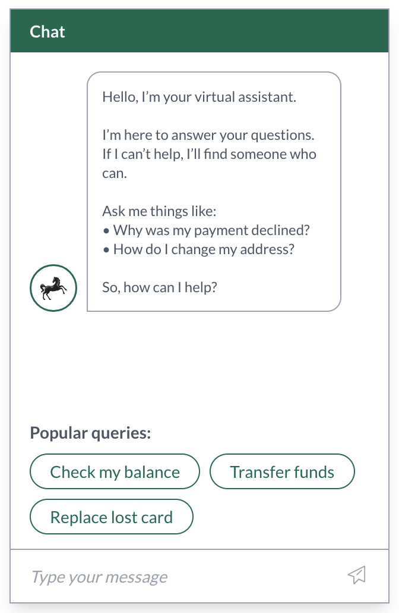
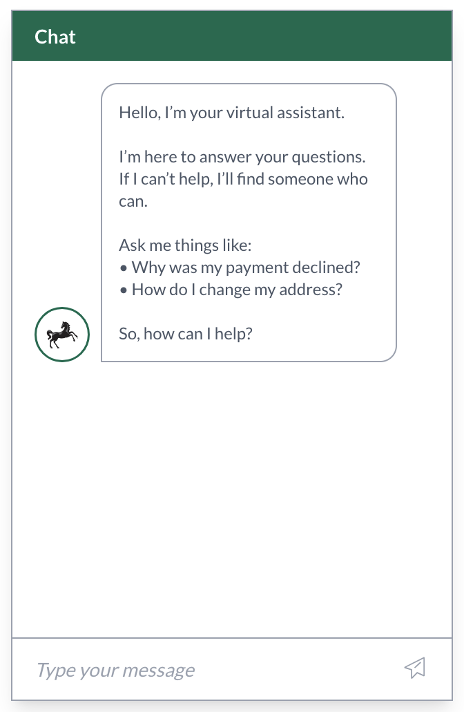

# 💬 Intent Ranking Assistant

This project is a proof-of-concept (POC) that surfaces the top 3 chatbot intents from the last X days (defaulting to 30 days), helping users fast-track common questions.

It demonstrates intent ranking, type-safe data handling, clean and accessible UI, initial test coverage, and considerations for how the design could scale in production.

## 🚀 Overview

-   ✅ TypeScript + Next.js App Router
-   ✅ Intent ranking based on frequency and average confidence
-   ✅ Edge case handling (ties, empty set, fewer than 3 intents)
-   ✅ Clean, accessible UI built with Tailwind CSS
-   ✅ Tested logic with factories and clear separation of concerns

## 🖼️ Preview

<div style="display: flex; gap: 16px;">
  <div style="text-align: center;">
    <p><strong>With Suggestions</strong></p>
    
  </div>
  <div style="text-align: center;">
    <p><strong>No Suggestions</strong></p>
    
  </div>
</div>

---

## 1. 🧱 Implementation & Code Structure

-   `src/app/actions/getRankedSuggestions.ts` — Server action returning the top 3 intents
-   `src/utils/getTopSuggestions.ts` — Pure function that ranks intents by frequency and confidence
-   `src/components/virtual-assistant/` — Self-contained UI with modular components (`Header`, `Body`, `Input`, `IntentSuggestions`)
-   `src/types/intents.ts` — Centralised intent schema with `IntentKey` and `IntentLabel` types
-   `src/data/technical_assessment_chatbot_data.json` — Mock data source

Code is structured for clarity and testability, with logic, UI, types, and data clearly separated.

---

## 2. 🧠 Development Considerations & Decisions

-   Split the assistant UI into semantic, reusable components
-   Kept the input and message display non-functional to focus on ranking logic
-   Used Tailwind CSS for fast, utility-first styling
-   Prioritised accessibility with semantic HTML, `role="dialog"`, and ARIA labels
-   Guarded against excess input — `IntentSuggestions` component includes configurable `limit` (default: 3)

---

## 3. 🧪 Testing

Unit tests were written using a TDD approach, supported by semantic commits and a `createRecord` factory.

The `getTopSuggestions` utility is tested with full coverage for:

-   Top 3 ranking by frequency
-   Tie-breaking by average confidence
-   Handling fewer than 3 results
-   Returning no results
-   Filtering by date (last X days)

Additional component tests verify:

-   Rendering of the heading and buttons
-   Limiting to 3 suggestions
-   Conditional rendering if list is empty

---

## 4. ☁️ Deployment & Production Design

### 📦 Current Setup (POC)

-   Fully client-side UI, with a server action reading a local JSON file
-   No real-time database or persistent cache (demo only)
-   Ideal for demonstrating the core ranking logic without external dependencies

### 📈 Aggregation Logic

While this POC reads and processes the full dataset to calculate top intents, I would recommend that in production, the logic aggregates from precomputed daily top 3s.

🧩 Aggregation could happen in:

-   A server action or frontend (as shown in this POC)
-   An on-demand Cloud Function that reads cached daily results and returns the top X intents
-   A scheduled Cloud Task that precomputes and stores rolling 7/30-day leaderboards

This approach centralises business logic, reduces runtime computation, avoids repeated full-data scans, and ensures consistent results across platforms.

### 🏗️ Production Recommendation (Google Cloud)

✅ Recommended Architecture

| Component         | Description                                                  |
| ----------------- | ------------------------------------------------------------ |
| 🕒 Cloud Function | Triggered nightly via Cloud Scheduler (e.g. midnight)        |
| 🧠 Compute        | Queries recent intent records and calculates the daily top 3 |
| 💾 Cache          | Stores results in Firestore, Cloud Storage, or Redis         |
| 🖥️ Frontend       | Reads precomputed values instead of performing live queries  |

This setup avoids expensive on-demand computation and ensures fast, predictable response times.

---

## 5. 🔮 Future Improvements

-   🔐 Add authentication awareness, allowing personalised suggestions for signed-in users
-   🌍 Localise suggestion labels for multilingual audiences
-   📊 Track click-through rates to measure suggestion effectiveness over time
-   ♿ Enhance accessibility, including keyboard navigation, screen reader support, and focus states
-   🧪 Add end-to-end tests for user flows using Playwright or Cypress

---

## 🤝 Questions Welcome

I'm happy to walk through any part of the code, testing, or decisions. Thank you!

## 🚀 To Run Locally

```bash
npm run dev
```

Open [http://localhost:3000](http://localhost:3000) with your browser to see the result.

## 🧪 To Run Tests

```bash
npm test
```
